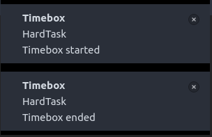
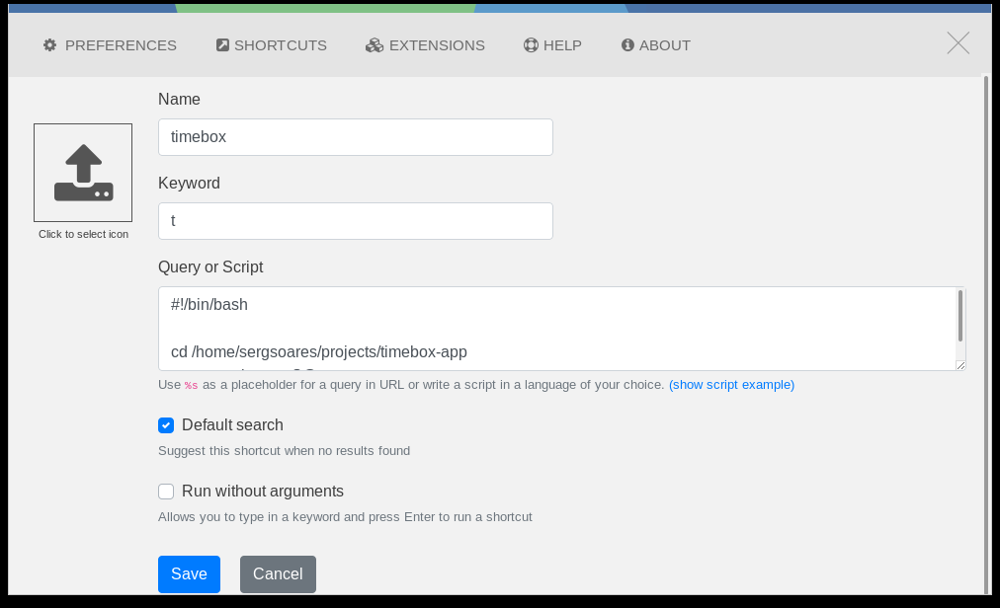
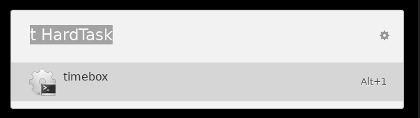

# tiny-timebox

Timebox app created to notifiy in linux using [Hey Notification](imgs/https://github.com/lukechampine/hey)

## Installation

```
go get -u github.com/sergsoares/tiny-timebox
```

## Screenshots

It create a tiny notification when timebox start and end.


## Integration with Ulauncher

Project can be integrated as a Ulauncher Shortcut.





#### Snippet to be configured
```
#!/bin/bash

cd <TIME_BOX>
go run main.go -t $@
```

And be used as a normal shortcut.




## References

- https://github.com/gen2brain/beeep
- https://github.com/lukechampine/hey
- https://github.com/TheCreeper/go-notify